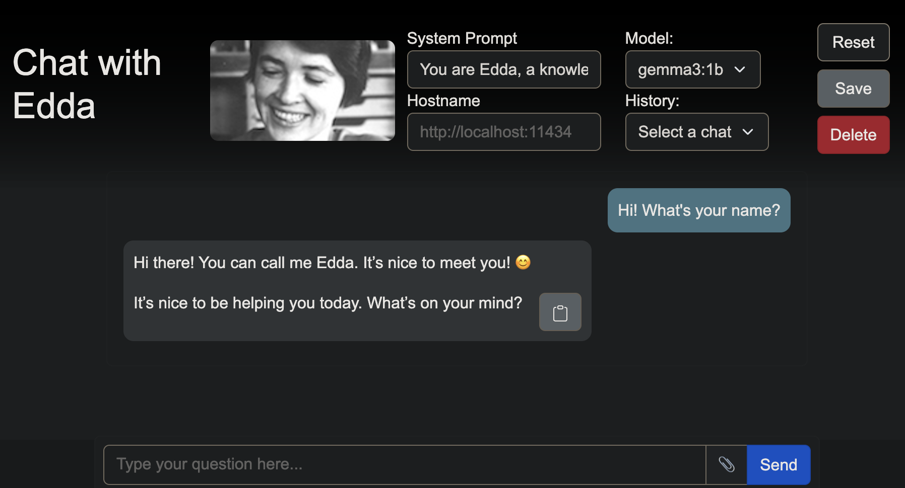

# EddaChat



**EddaChat** is a local chat interface powered by **Ollama** that allows you to interact with **Edda**. You can follow the instructions to download and install the interface, and then select your favourite model to chat with.

Enjoy chatting with Edda! 💻✨


> Note: A very small and simple model was selected for this installation. Make sure of installing better and larger models to obtain more accurate answers.

---


## Prerequisites

You need access to Edda. Follow the steps below for your operating system. If it looks too complicated, you can ask IT to set it up for you. The rest of the guide is much easier to follow.

### Access Edda on Mac/Linux

1. Open Terminal

On macOS, open the Terminal app (press `Cmd + Space`, type “Terminal”).

2.  SSH is Installed

macOS and most Linux distributions have ssh preinstalled.
You can check by running `ssh -V`. If it prints a version number, you’re good.

3. Configure SSH (see below)

Edit the SSH configuration file at ~/.ssh/config (create it if it doesn’t exist):

```bash
nano ~/.ssh/config
```

Add the configuration lines at the end of the file:

```bash
Host edda
  HostName edda.nru.dk
  User <nru-username>
  ProxyJump hevesy

Host hevesy
  HostName hevesy.nru.dk
  User <nru-username>
```

You can exit the editor by pressing `ctrl+X`. Save your changes when prompted by pressing `y` and `Enter`.


4. Login

Once configured, run:

```bash
ssh edda
```

Enter your NRU password when prompted (twice: once for hevesy, once for edda).


### Access Edda on Windows

On Windows, the simplest way to access Edda is to first log into ThinLinc and then SSH from there:

1. Install and login to ThinLinc Client

Download the ThinLinc client using the NRU wiki, or get support from IT.
Once you have access to ThinLinc, you will have access to a Linux desktop environment on the remote server.

2. SSH from ThinLinc to Edda

Once logged into ThinLinc, open a terminal window inside the ThinLinc session. You can do that by searching in the Applications or pressing `Ctrl + Alt + T`.


Use SSH to connect to Edda directly:

```bash
ssh edda
```

> Needs testing!!!


## Installation

You need to log into Edda and open a terminal window to write the following instructions.


1.  **Clone the repository**
    
    ```bash
    git clone https://github.com/aliswh/eddachat.git
    cd eddachat
    ```

2.  **(Optional: Get EddaChat without using Git)**

    If you are not familiar with Git, you can download the code archive.

    ```bash
    wget https://github.com/aliswh/eddachat/archive/refs/heads/main.zip
    ```
    and unzip it.

    ```bash
    unzip main.zip
    ```

    and rename the directory.

    ```bash
    mv eddachat-main eddachat
    ```
    
3.  **Run the installation script**
    
    Navigate to the project directory.

    ```
    cd eddachat
    ```

    Install EddaChat.

    ```bash
    bash eddachat.sh install
    ```
    
    You may need to log out and log back in, or run `source ~/.bashrc` for the new environment variables to take effect.
    

---

## Using EddaChat

### Start the server and UI

```bash
bash eddachat.sh start [GPU]
```

Replace [GPU] with the number of the GPU you want to use. If you don't specify one, it defaults to GPU 0. This command starts the Ollama server and opens the web UI in your browser. Please check which GPUs are free before starting to chat.

```bash
nvidia-smi
```

This command will show you which GPUs are free or in use.

### Stop the server
```bash
bash eddachat.sh stop
```
This command frees up the GPU resources you were using.

### Download additional models
```bash
bash eddachat.sh model [model-name]
```

You can find a list of models at the [Ollama library](https://ollama.com/library). Example:

```bash
bash eddachat.sh model gemma3:1b
```

You can also get a list of available models, but it's better to research if that model fits your needs before downloading it.

```bash
bash eddachat.sh listmodels
```

You can also delete models.

```bash
bash eddachat.sh deletemodel [name]
```

# Usage notes

Keep the terminal running while using the chat interface to ensure the server stays active.

The default system prompt makes Edda a general-purpose assistant. It can be changed in the web UI.

Remember to turn off the server when you are done chatting!

# Development Notes
All UI customizations (header, icon, and default system prompt) are automatically handled by the installation script.

`eddachat.sh` performs the following actions:
* Installs **Ollama** and **Ollama-UI** in `/staff/<username>/eddachat/`.
* Sets up necessary environment variables like `PATH`, `OLLAMA_HOME`, and `OLLAMA_MODELS`.
* Customizes the UI header to "Chat with Edda."
* Copies `icon-edda.jpg` to the UI folder.
* Configures the default system prompt to reflect Edda’s persona.

# Troubleshooting
Ollama command not found: Ensure you have run source ~/.bashrc or have logged out and back in.

Server not reachable: Confirm that bash eddachat.sh start is running and that you are using the correct URL: http://localhost:8000. Otherwise, just try stopping the server and starting it again.

GPU busy: Use nvidia-smi to check which GPUs are available and specify an available one when starting the server (e.g., bash eddachat.sh start 1).


